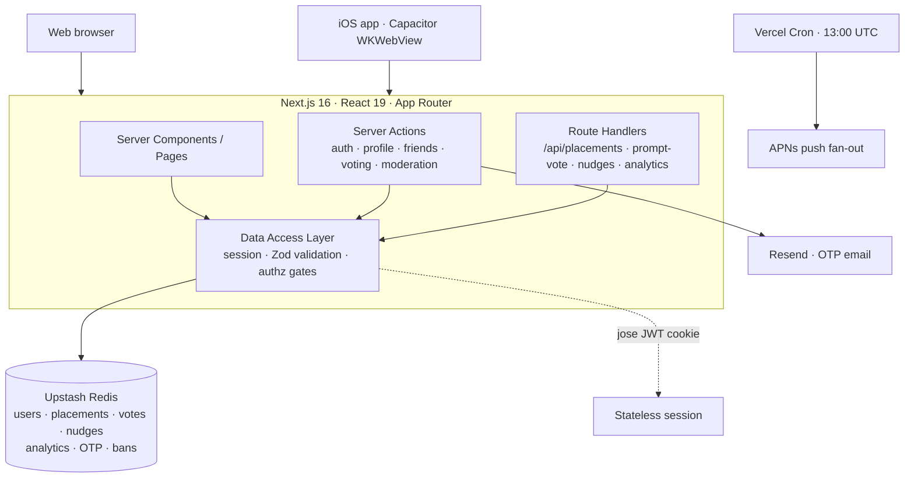

# The Daily Graphs

**One question a day. Place yourself on the graph, then see where your friends land.**

A daily social game: every day a brand-new two-axis prompt drops, you drag your dot onto the
graph where you stand, and the moment you place, the board reveals where everyone you know
ended up — plus a playful "nudge" mechanic that lets you shove friends around the plot.

### ▶ Live at **[thedailygraphs.com](https://thedailygraphs.com)** — also shipped as an iOS app.


---

## What it is

There are no feeds and nothing to doomscroll — just **today's** graph. A new prompt resets the
board at midnight, you place yourself once, and you see your friends' placements as a scatter
with a regression line through the cloud. Come back tomorrow for a new question.

- **Daily two-axis prompt** — place a single dot on an X/Y plane (e.g. *introvert ↔ extrovert*, *night owl ↔ early bird*).
- **Friends-only reveal** — your friends' dots appear only after you've placed; an "Everyone" mode shows an anonymized heatmap.
- **Nudges** — drag a friend's dot to nudge them somewhere new; see who nudged you with color-coded lines and haptic feedback on iOS.
- **Community prompt voting** — suggest tomorrow's prompt and vote; the top pick at midnight ET wins.
- **Friend graph** — requests, mutual-friend hints, and custom friend groups you can filter the graph by.
- **Avatars** — upload a photo or hand-build a cartoon face in the in-app designer.
- **Streaks & history** — a 🔥 streak counter and a browsable 30-day archive of past placements.
- **Moderation & analytics** — in-app reporting, an admin ban queue, and a DAU / active-time dashboard.

## Engineering highlights

This started as a fun product but the interesting work is underneath it — the concurrency,
auth, and data-model decisions that keep a shared, real-time-ish board correct under load.

- **Concurrency-safe writes on Redis.** First placement of the day is atomic via `HSETNX`, so a
  double-tap or a retried request can never double-count a user or inflate analytics.
  One-vote-per-round is enforced with a single atomic `HSET` (`userId → suggestionId`), so
  switching your vote can't double-count either.
- **Hardened, stateless auth.** Sessions are JWTs (`jose`) in `httpOnly` cookies — no session
  table to scale. Passwords are bcrypt-hashed, and a password change revokes every prior
  session by comparing the token's millisecond-precision issue time against `passwordChangedAt`
  (so even a same-second reset invalidates old sessions).
- **OTP email verification + password reset.** Six-digit codes with attempt limits, a 1-minute
  resend cooldown, and a 5/hour rate cap kept on **separate** keys — plus constant-time handling
  so there's no account-existence timing oracle on signup or forgot-password.
- **Validation everywhere.** Every input is parsed with Zod (auth, profile, avatar config,
  photo uploads, OTP codes). Placement/nudge coordinates are rejected unless they're finite
  numbers, and JSON routes guard against null/non-object bodies — a bad request gets a `400`,
  never an uncaught `500`.
- **Moderation that can't be raced.** Bans live on an isolated `user:{id}:ban` key, so a
  concurrent profile edit can't silently clobber a ban. Report targets are derived server-side
  from the stored report (not a client-supplied id), and a per-`(reporter, target)` dedupe guard
  blocks spam-reporting while still allowing re-reports after a case is resolved.
- **A data model built for the hot path.** Photos and bans live on side keys so the
  per-request `/api/today` read stays lean; day-scoped data (placements, votes, nudges, OTPs)
  carries TTLs; and a self-healing sorted-set index of a user's active dates powers the streak
  counter and back-fills itself on every placement.
- **Genuinely cross-platform.** A single Next.js deployment serves the web app and the
  Capacitor iOS shell (a remote-URL WKWebView), with haptics on nudge drags, APNs push, and a
  daily push fan-out driven by a Vercel Cron job.
- **Zero-dependency local mode.** An in-memory Redis stub that faithfully honors TTLs (so OTP
  expiry, cooldowns, and rate limits behave exactly as in production) plus an auth-bypass flag
  let the whole app run with no external services — `git clone` to running in one command.

## Architecture

The web client and the iOS WebView both hit the same Next.js App Router deployment. Server
Components and Server Actions handle reads and mutations directly; a thin set of Route Handlers
serves the polling/real-time endpoints. Everything funnels through a Data Access Layer that owns
session decoding, Zod validation, and authorization gates before touching Redis.



## Tech stack

| Area | Choice |
| --- | --- |
| Framework | Next.js 16.2.7 (App Router, Server Actions) |
| UI | React 19.2.4, Tailwind CSS 4, HTML Canvas for the graph |
| Language | TypeScript 5 (`strict`) |
| Auth | `jose` 6 (JWT sessions), `bcryptjs` 3 (password hashing) |
| Data | Upstash Redis (`@upstash/redis` 1.37) + in-memory stub for local dev |
| Validation | Zod 4 on every input |
| Mobile | Capacitor 8 (iOS WKWebView, Haptics, Push Notifications) |
| Hosting | Vercel (Functions + Cron) |

## Data model

State lives in Redis under a handful of key families. Day-scoped data expires on its own; durable
records (users, friendships, bans, reports) persist.

| Key family | Holds | TTL |
| --- | --- | --- |
| `user:{id}` + email/username indexes | Account, password hash, avatar config | persistent |
| *(session)* | Stateless JWT in an `httpOnly` cookie — no Redis row | 30-day cookie |
| `placements:{date}` | One placement per user per day (atomic via `HSETNX`) | 30 days |
| `prompt_suggestions:{date}` / `prompt_votes:{date}` | Tomorrow's prompt candidates and one vote per user | 60 days |
| `nudges:{date}` | Friend-to-friend nudge offsets | 1 day |
| `otp:{purpose}:{id}` (+ cooldown / rate-limit keys) | Verification & reset codes | 10 min / 1 hr |
| `user:{id}:ban` | Ban state, isolated from the user record | persistent |
| `report:{id}` / `reports:open` | Moderation queue + audit trail | persistent |
| `user:{id}:friends` / `:incoming` / `:outgoing` | Friend graph (sets) | persistent |
| `analytics:*` | DAU sets, heartbeat / placement / signup counters | 90 days |
| `user:{id}:photo` | Base64 avatar photo, kept off the hot path | 30 days |

## Project structure

```
app/
  (auth)/          Login, signup, email verification, forgot/reset password
  actions/         Server Actions — auth, verification, profile, friends, voting, moderation
  api/             Route Handlers — placements, prompt-vote, nudges, avatar, analytics, cron/push
  admin/  team/    Admin analytics dashboard + ban queue (admin-only)
  friends/ profile/ settings/ vote/ history/ banned/
  HomeClient.tsx   Graph interaction: placement, nudges, focus, filtering
lib/               Domain core — dal, session, otp, users, validation, redis (+ in-memory stub),
                   placements, voting, nudges, moderation, analytics, avatar, today, graph
components/        GraphCanvas, Avatar, Dot, ReportDialog, …
ios/               Capacitor iOS app (WKWebView shell)
```

## Running locally

Prerequisites: Node 20+. Thanks to the in-memory data store and auth-bypass flag, no database or
login is required to try it:

```bash
USE_IN_MEMORY_REDIS=1 DEBUG_BYPASS_AUTH=1 SESSION_SECRET=$(openssl rand -hex 32) npx next dev -p 3004
```

Then open <http://localhost:3004>. For dev flags, the admin dashboard, Resend email setup, the
full environment-variable reference, and deployment notes, see **[SETUP.md](./SETUP.md)**.

---

Built with Next.js 16 and React 19; deployed on Vercel.
